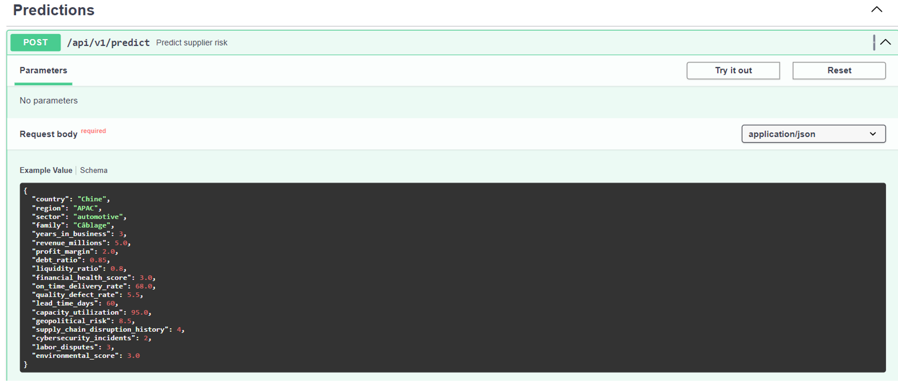
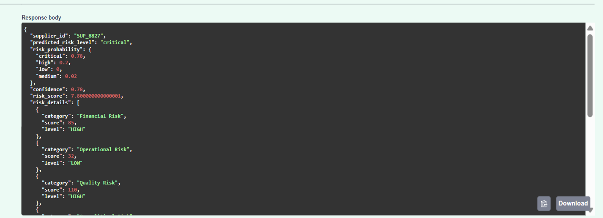

API FastAPI
===========

Objectif
--------

L’API permet l’accès aux prédictions en temps réel à partir des modèles
enregistrés dans MLflow.

Endpoints Principaux
--------------------

- ``POST /api/v1/predict/retard``
- ``POST /api/v1/predict/risque``

Validation des Données
----------------------

- Validation des requêtes avec **Pydantic**
- Gestion des erreurs
- Chargement dynamique des modèles depuis le registry MLflow

Format des Réponses
-------------------

Les réponses incluent :

- Niveau de risque
- Probabilité associée
- Recommandations potentielles

