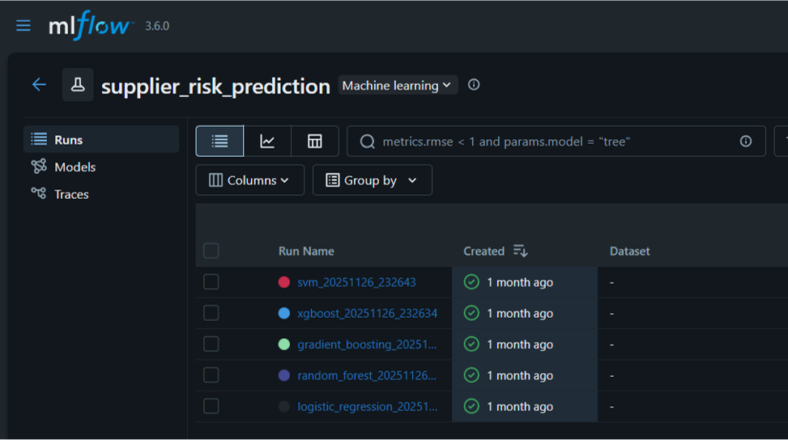

Modélisation et MLflow
=====================

Modèles de Machine Learning
---------------------------

Deux modèles principaux ont été développés :

- Prédiction des retards : Random Forest
- Prédiction des défauts : Classification supervisée

Tracking des Expériences
------------------------

MLflow est utilisé pour :

- Enregistrer les paramètres
- Suivre les métriques de performance
- Sauvegarder les artefacts
- Comparer automatiquement les modèles

Sélection du Modèle
-------------------

Le meilleur modèle est sélectionné automatiquement selon les métriques
de performance et enregistré dans le **MLflow Model Registry**.

